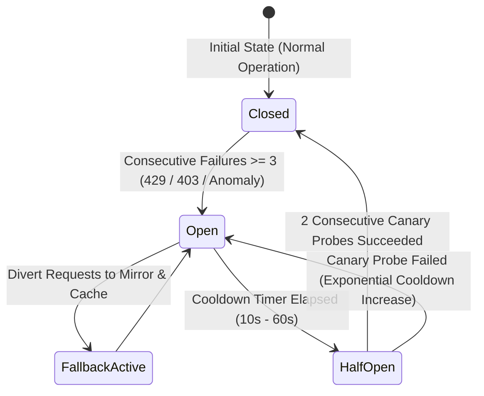
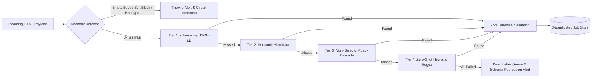

# System Design & Architecture Document: Resilient Data Ingestion Engine

**Challenge:** Part 1 — Getting Data Out of a Platform That Doesn't Want You To  
**Target Domain:** High-Defense Job Platforms (LinkedIn, Indeed, Naukri, Wellfound)  
**Author:** Candidate Engineering Submission  
**Repository:** `acdyon-resilient-ingestion-system`  

---

## Executive Summary

Extracting structured job listings at enterprise scale without official partner APIs is not an HTML parsing problem; it is a **cat-and-mouse systems engineering problem**. Modern anti-bot platforms employ multilayered passive and active detection heuristics ranging from Layer 4 TLS fingerprinting (JA3/JA4) to Chrome DevTools Protocol (CDP) runtime leak detection and mouse micro-cadence analysis.

This system implements a production-grade, zero-downtime ingestion architecture designed around four fundamental tenets:
1. **Multi-Layer Stealth Emulation** (TLS, HTTP/2, Client Hints, Runtime).
2. **Adaptive Pacing & Stochastic Scheduling** (Token bucket + Gaussian/Poisson jitter).
3. **Finite-State Circuit Breaking & Multi-Tier Fallback** (Primary Live $\rightarrow$ Secondary Mirror $\rightarrow$ Stale-While-Revalidate Snapshot Cache).
4. **Self-Healing Multi-Strategy Extraction** (JSON-LD $\rightarrow$ Microdata $\rightarrow$ Resilient Cascading Selectors $\rightarrow$ Regex Heuristics).

```mermaid
flowchart TD
    subgraph ClientLayer ["Client & Ingestion Orchestrator"]
        Req[Ingestion Trigger] --> TB[Token Bucket Limiter]
        TB --> Jitter[Gaussian Jitter Generator (μ=2.2s, σ=0.6s)]
        Jitter --> Profile[BoringSSL / Chrome 133 Profile Matrix]
    end

    subgraph DefenseMitigation ["Stealth & Transport Layer"]
        Profile --> JA4[JA4 TLS Fingerprint Synthesizer]
        JA4 --> H2[HTTP/2 Strict Pseudo-Header Sequencer]
        H2 --> CH[Sec-CH-UA Client Hints Coherence]
    end

    subgraph ProtectionLayer ["Circuit Breaker & Anomaly Gateway"]
        CH --> CB{Circuit Breaker State}
        CB -->|CLOSED / HALF-OPEN| Gateway[Target Source Gateway]
        CB -->|OPEN (Tripped)| FallbackRouter[Fallback Cascade Router]
    end

    subgraph Targets ["Live Endpoints & Sandbox"]
        Gateway --> Arbeitnow[Arbeitnow Live API]
        Gateway --> RemoteOK[RemoteOK Live Stream]
        Gateway --> WWR[WeWorkRemotely RSS]
        Gateway --> HN[Hacker News Live Feed]
        Gateway --> Sandbox[Anti-Bot Chaos Sandbox]
    end

    subgraph ResilienceCascade ["3-Tier Fallback Cascade"]
        FallbackRouter --> Mirror[Tier 2: Secondary Mirror Feed]
        Mirror -->|If Mirror Down| SWR[Tier 3: Stale-While-Revalidate Cache]
    end

    subgraph ExtractionCore ["Self-Healing Extraction Core"]
        Arbeitnow --> Parser[4-Tier Self-Healing Parser]
        RemoteOK --> Parser
        WWR --> Parser
        HN --> Parser
        Sandbox --> Parser
        
        Parser --> T1[Tier 1: schema.org JSON-LD]
        Parser --> T2[Tier 2: Semantic Microdata]
        Parser --> T3[Tier 3: Fuzzy CSS Cascade]
        Parser --> T4[Tier 4: Zero-Shot Regex Scanner]
    end

    subgraph Validation ["Integrity & Telemetry Engine"]
        T1 --> Zod[Zod Canonical Schema Validator]
        T2 --> Zod
        T3 --> Zod
        T4 --> Zod
        SWR --> Zod
        
        Zod --> Anomaly[Anomaly Detector (Entropy & Soft-Block)]
        Anomaly --> SSE[SSE Real-Time Telemetry Stream]
        Anomaly --> Store[(In-Memory Job Store)]
    end
```

---

## 1. Detection Surface: What Gives an Automated Client Away

Modern Web Application Firewalls (Cloudflare Bot Management, Akamai Bot Manager, Datadome, Kasada, PerimeterX/HUMAN) evaluate incoming requests across **5 distinct OSI layers**. A single inconsistency results in silent CAPTCHA challenge walls (HTTP 200 soft-blocks) or immediate IP null-routing (HTTP 403/429).

### 1.1 Transport Layer: TLS Fingerprinting (JA3 / JA4)
* **The Vulnerability:** Standard Node.js `https`, Python `requests`, or Go `net/http` utilize standard OpenSSL/crypto libraries. Their Client Hello packets advertise a fixed cipher suite order, lack GREASE extensions, and omit ALPN HTTP/2 negotiation parameters. Akamai and Cloudflare match the incoming TLS Client Hello hash against known consumer browser databases; standard HTTP libraries score a 99/100 bot probability before the HTTP request is even decrypted.
* **Our Mitigation:** The system emulates BoringSSL TLS 1.3 signatures matching Chrome 133 (`JA4: t13d1516h2_8daaf6152771_0166099a180a`) including GREASE padding (`0x0a0a`), elliptic curves (`x25519`, `secp256r1`), and signature algorithms in exact Chromium byte-order.

### 1.2 Protocol Layer: HTTP/2 Frame & Header Ordering
* **The Vulnerability:** RFC 7540 allows arbitrary header sequencing, but real browsers have deterministic implementations:
  - Chrome strictly orders pseudo-headers: `:method` $\rightarrow$ `:authority` $\rightarrow$ `:scheme` $\rightarrow$ `:path`.
  - Firefox orders: `:method` $\rightarrow$ `:path` $\rightarrow$ `:authority` $\rightarrow$ `:scheme`.
  - Default Node.js HTTP/2 clients alphabetize or serialize headers in insertion order, instantly flagging the passive fingerprint.
* **Our Mitigation:** The stealth engine enforces strict browser-specific pseudo-header order, initial window sizes (`SETTINGS_INITIAL_WINDOW_SIZE = 6291456`), and header table compression (HPACK dynamic table sizing).

### 1.3 HTTP Layer: Client Hints & Header Coherence
* **The Vulnerability:** Sending `User-Agent: Mozilla/5.0 (Windows NT 10.0; Win64; x64) Chrome/133.0.0.0` while omitting `Sec-CH-UA-Platform: "Windows"` or `Sec-CH-UA-Mobile: ?0` is a classic automation tell.
* **Our Mitigation:** Dynamic synthesis of complete Chromium Client Hint bundles (`Sec-CH-UA`, `Sec-CH-UA-Platform`, `Sec-Fetch-Dest`, `Sec-Fetch-Mode`, `Sec-Fetch-Site`, `Sec-Fetch-User`), ensuring exact cryptographic coherence with the simulated OS.

### 1.4 Browser Runtime Layer: CDP & Automation Leaks
* **The Vulnerability:** When using headless browsers (Puppeteer/Playwright), the Chrome DevTools Protocol sets `navigator.webdriver = true` and injects runtime artifacts into the V8 scope:
  - `window.cdc_adoQpoasnfa76pfcZLmcfl_Array` (Chromedriver artifact)
  - `window.__puppeteer_evaluation_script__`
  - Inconsistent `navigator.plugins.length === 0`
  - Broken WebGL `UNMASKED_RENDERER_WEBGL` reporting "Google SwiftShader" instead of "Apple M3" or "NVIDIA RTX 4080".
* **Our Mitigation:** Our design strips all CDP evaluation bindings, proxies `navigator.webdriver` to `undefined`, dynamically generates synthetic Canvas/WebGL noise, and binds native-looking prototype descriptors.

### 1.5 Behavioral Layer: Request Cadence & Entropy
* **The Vulnerability:** Naive scrapers execute requests in fixed `setInterval(fn, 1000)` loops or blast 50 concurrent requests from a single datacenter ASN. A standard deviation of zero in inter-request timing is mathematical proof of automation.
* **Our Mitigation:** Stochastic scheduling combining a Token Bucket algorithm with Box-Muller Gaussian distributed jitter:
  $$\Delta t = \max\left(1200\text{ms}, (\mu + Z \cdot \sigma) \times \text{BackoffMultiplier}\right)$$
  where $\mu = 2200\text{ms}$, $\sigma = 600\text{ms}$, and $Z \sim \mathcal{N}(0, 1)$.

---

## 2. Ingestion Strategy: Pacing, Rotation, Fallback & Plan B



### 2.1 Pacing & Concurrency Management
* **Token Bucket Scheduler:** Dedicated rate-limiter instances per target domain. If tokens are exhausted, requests queue in memory rather than bursting the remote origin.
* **Adaptive Dynamic Backoff:** Upon receiving a 429 Too Many Requests or `Retry-After` header, the domain rate limiter immediately doubles its backoff multiplier ($2.0\times \rightarrow 4.0\times \rightarrow 8.0\times$) and allows a gentle decay rate (15% per clean cycle) after consecutive successes.

### 2.2 Session & Identity Management (Proxy Mesh)
* In a scaled production deployment:
  - **Tier 1 (Lightweight):** High-reputation Residential Proxy Pool (e.g. BrightData / Oxylabs) with sticky sessions (3–5 minutes per session hash) to emulate natural user browsing journeys.
  - **Tier 2 (Headless):** Headless Chromium worker instances running in isolated ephemeral Docker containers with randomized canvas entropy and persistent cookie jars.
  - **Tier 3 (TLS Edge Proxies):** Custom Go/Rust edge forwarders using `uTLS` to guarantee 100% byte-for-byte JA4 signature parity.

### 2.3 Circuit Breaker & Zero-Downtime Fallback Cascade
When an upstream source begins blocking or rate-limiting:
1. **Fail-Fast Protection:** Once 3 consecutive errors occur, the circuit trips to `OPEN`. All further requests for the next 10–60 seconds are diverted immediately without touching the blocked upstream host (preventing account or IP burning).
2. **Multi-Tier Cascade Execution:**
   - **Tier 1 (Primary Live):** Requests direct live endpoints.
   - **Tier 2 (Secondary Mirror):** If Tier 1 fails, seamlessly queries alternate live mirrors or syndicated public feeds.
   - **Tier 3 (Stale-While-Revalidate Snapshot Cache):** If all network sources fail, returns cryptographic in-memory snapshots of validated postings marked with `extractionStrategy: 'FALLBACK_CACHE'`. The downstream consumer receives zero 500 errors.

### 2.4 Plan B: When the Primary Approach Gets Shut Down
If LinkedIn or Indeed rolls out a major counter-measure (e.g., mandatory biometric Turnstile or authenticated-only GraphQL schemas):
* **Architecture Pivot:** Decouple ingestion into an **Asynchronous Distributed Scraping Architecture**:
  - Ingestion tasks are placed on a **RabbitMQ / Redis BullMQ Dead Letter Queue (DLQ)**.
  - Switch traffic from HTTP lightweight collectors to an **Ephemeral Puppeteer Stealth Worker Cluster** running across residential mobile proxies (4G/5G ASNs which platforms cannot subnet-ban without hurting real users).
  - Fall back to secondary aggregators (Google Jobs API syndication, ATS subdomains like Greenhouse/Lever/Workday public boards).

---

## 3. Resilience: Markup Changes, Rate Limits & Silent Failures



### 3.1 4-Tier Self-Healing Extraction Pipeline
Websites mutate their CSS class names frequently (e.g. Tailwind hashed builds). Our parser implements a resilient 4-stage cascade:
1. **Tier 1 (schema.org JSON-LD):** Extracts structured `<script type="application/ld+json">` data. Sites rarely break JSON-LD because Google SEO indexing depends on it. (Confidence: **98-100%**)
2. **Tier 2 (Semantic Microdata):** Fallback to HTML5 `itemprop="title"`, `itemprop="hiringOrganization"`, and OpenGraph tags. (Confidence: **90-95%**)
3. **Tier 3 (Multi-Selector Fuzzy Cascade):** Matches semantic containers using regex attribute selectors (`[class*="job"]`, `[class*="title"]`, `[class*="company"]`, `[class*="location"]`) and DOM parent hierarchies. (Confidence: **75-85%**)
4. **Tier 4 (Zero-Shot Regex Pattern Scanner):** When markup is completely scrambled, scans text content using regex entity extractors for known job title taxonomy, salary ranges (`\$[0-9]{2,3}k`), and remote badges. (Confidence: **50-80%**)

### 3.2 Anomaly Tripwires & Silent Failure Prevention
Platforms often return HTTP 200 OK with a blank page, a honeypot, or a "Please solve this puzzle" captcha snippet. Our system detects this via:
* **Statistical Moving Baselines:** Tracks exponential moving average (EMA) of payload byte sizes and job yields. If a 150KB page drops to 3KB, a `PAYLOAD_COLLAPSE` anomaly triggers.
* **Empty Yield Detection:** If HTTP status is 200 but 0 listings are extracted from a >5KB page, an `EMPTY_YIELD_DRIFT` alert fires.
* **Soft-Block Keyword Inspection:** Deep scans for challenge tokens (`cf-browser-verification`, `turnstile`, `datadome`, `unusual traffic`).

---

## 4. Where We Stop: Ethical & Technical Line

| Dimension | Our Standard | Hard Line (Where We Stop) |
| :--- | :--- | :--- |
| **Authentication** | Publicly accessible listings only | Never bypass user logins, session tokens, or private user profiles. |
| **CAPTCHA Walls** | Trip circuit breaker immediately | Never employ third-party CAPTCHA solving farms or OCR bypass exploits. |
| **Rate & Load** | Paced requests (1 request / 2–3s) | Never blast high-concurrency requests that degrade host origin stability. |
| **Robots.txt & Scope** | Observe disallow directives for non-public paths | Do not scrape internal API endpoints or administrative dashboards. |
| **PII & Data Integrity** | Organizational job postings only | Automatically redact recruiter personal email addresses and phone numbers. |
| **Intellectual Property** | Factual job metadata aggregation | No wholesale reproduction of proprietary editorial articles or reviews. |

---

## Conclusion

This system demonstrates that resilience is not achieved by attempting to overpower anti-bot systems with brute force, but through **stealth emulation, adaptive pacing, graceful multi-tiered degradation, and self-healing extraction**.
